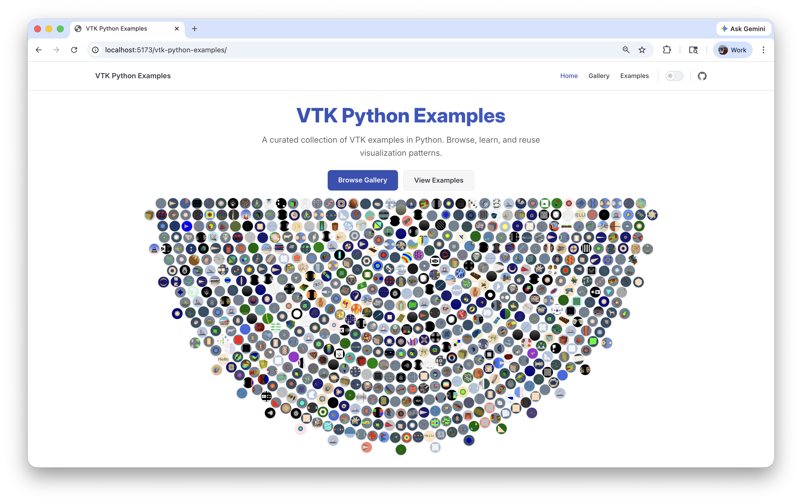

# VTK Python Examples

A curated collection of VTK examples in Python with screenshots and documentation.



## Prerequisites

- Python 3.12+
- [uv](https://docs.astral.sh/uv/)
- Node.js 18+ (for the docs site)

### Python Dependencies

Managed via `pyproject.toml` and installed with `uv sync`:

- **vtk** — Visualization Toolkit
- **numpy** >=2.4.2 — array operations
- **pandas** >=3.0.1 — data-oriented examples
- **pyqt6** >=6.10.2 — Qt GUI examples (optional: `uv sync --extra qt`)
- **pytest** / **pytest-xdist** — testing (dev)

## Setup

For full development setup (building the docs site, running tests), see [CONTRIBUTING.md](CONTRIBUTING.md).

## Running an Example

### 1. Set up a Python environment

You need Python 3.12+ with VTK and NumPy. The quickest way using [uv](https://docs.astral.sh/uv/):

```bash
uv init my-vtk-project && cd my-vtk-project
uv add vtk numpy
```

Or with pip:

```bash
python -m venv .venv && source .venv/bin/activate
pip install vtk numpy
```

### 2. Download and run an example

Browse the [example gallery](https://kitware.github.io/vtk-python-examples/gallery), find an example you like, and copy the Python code into a local file. All examples are standalone — just save and run:

```bash
python Cone.py
```

### 3. Examples that require data files

Some examples need external data (meshes, images, volumes). The example page lists the required files under a **Data** section with download links. Download them into the same directory as the script:

```
Cone.py
cow.obj        ← downloaded data file
```

Then run as usual:

```bash
python FlatVersusGouraud.py
```

If you prefer to keep data files in a separate directory, set the `VPE_DATA_DIR` environment variable:

```bash
VPE_DATA_DIR=/path/to/data python FlatVersusGouraud.py
```

### 4. Qt examples

The Qt examples additionally require PyQt6:

```bash
uv add pyqt6    # or: pip install pyqt6
python SideBySideRenderWindows.py
```

## Running Tests

All testing is handled by a single file: `src/tests/test_examples.py`.

### Run all examples (default — batch mode)

Each category runs in a separate subprocess to avoid resource exhaustion:

```bash
uv run python src/tests/test_examples.py
```

### Run a single category

Runs all examples in a category in-process:

```bash
uv run python src/tests/test_examples.py --category GeometricObjects
```

### Run a single example

```bash
uv run python src/tests/test_examples.py --example GeometricObjects/Cone
```

### List categories and examples

```bash
uv run python src/tests/test_examples.py --list-categories
uv run python src/tests/test_examples.py --list-examples Filtering
```

### Via pytest

The test class is auto-generated from the manifest, so pytest works directly:

```bash
uv run python -m pytest src/tests/test_examples.py -v -s
uv run python -m pytest src/tests/test_examples.py -k "test_Filtering_" -s
```

## Contributing

We welcome contributions! Every example teaches a specific VTK pipeline — self-contained, explicit, and written as if it were the reader's first example.

See [CONTRIBUTING.md](CONTRIBUTING.md) for coding standards, pipeline patterns (including chart and graph variants), markdown file format, and submission steps.

## Rebuilding the Docs

From the `docs/` directory:

```bash
npm run publish
```

This single command:

1. Regenerates all pages, sidebar, gallery, images, and JSONL from `test_manifest.json`
2. Builds the static VitePress site
3. Serves it locally for preview

## Project Structure

```
src/
  Python/{Category}/{Title}.py    # Example scripts
  Python/{Category}/{Title}.md    # Companion descriptions
  tests/test_manifest.json        # Single source of truth for all examples
  tests/test_examples.py          # Test harness
scripts/
  generate_examples_jsonl.py      # Generates all doc artifacts
data/
  examples.jsonl                  # Full dataset (JSONL)
  images/testing/                 # Test screenshots
docs/
  .vitepress/config.mjs           # VitePress config
  .vitepress/generated/           # Auto-generated sidebar and gallery data
  examples/                       # Auto-generated per-example pages
  public/images/                  # Auto-generated screenshot copies
```
